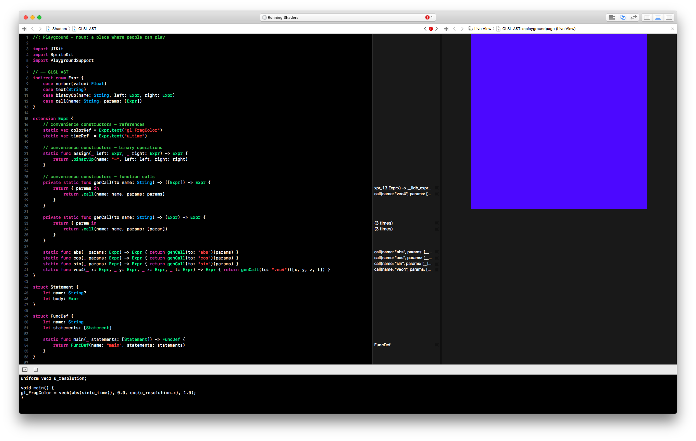
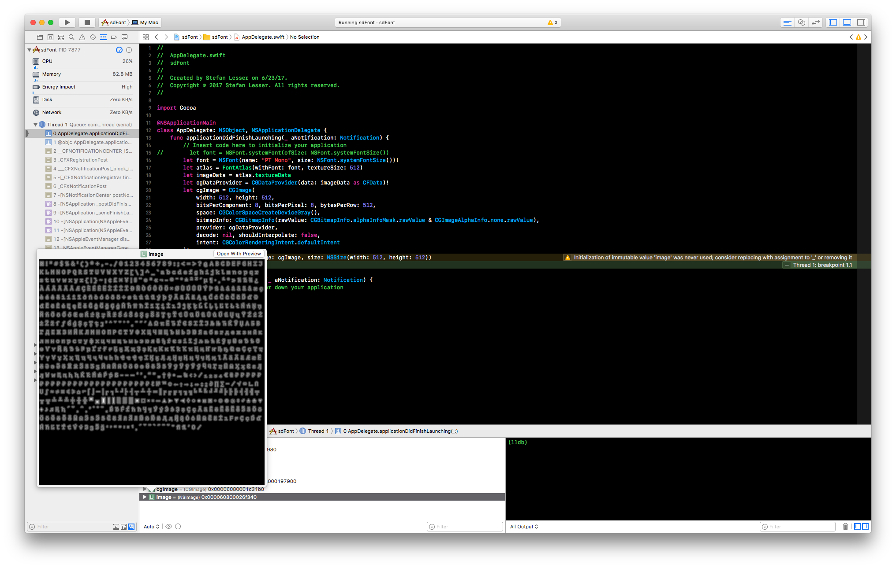
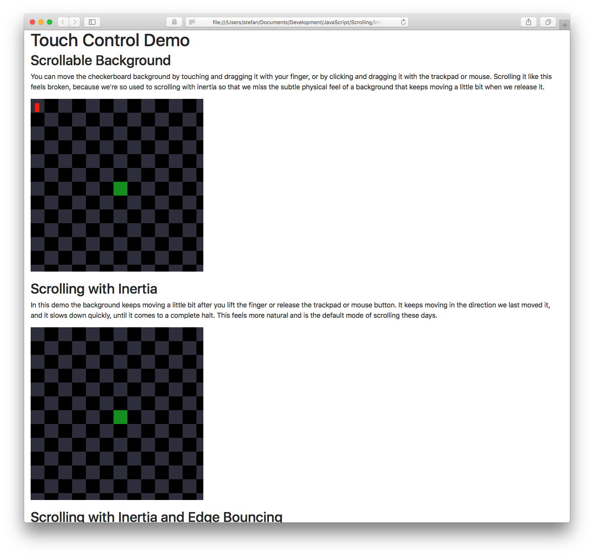

# Projects

List of things I started (and likely didn't finish) at RC.

## hTron

Simple terminal-based multiplayer game based on [an old arcade game for the Commodore 64](https://github.com/mist64/ultimatetron2).
I started implementing the game logic in a purely functional style in Haskell to learn the language and have a more exciting project than the usual chapter exercises. There are some hSpec tests for the core game logic from a few TDD sessions.
Currently it's fewer than 200 lines of Haskell code written by a Haskell beginner and likely easy to understand for people interested in learning Haskell / functional programming.

Next steps:
* Implement collision detection — it's really only fun if you can actually bump into other players
* Add scoring and score board — so you know who's winning
* Explosions! — the original game has explosions that tear down walls and create new openings, including in the outer grid boundaries, which allows players to escape the grid
* Use a writer monad to log state changes during execution which can be used for debugging
* Double the resolution by taking advantage of upper/lower-half unicode characters rendered with different foreground/background colors

Other ideas around this:
* FrankenTron — How many different programming languages can I combine to run this game? The idea is to have the core game logic in Haskell, a stateful wrapper in Swift managing the per-round state, a Rack-based HTTP server written in Ruby to provide a REST API, and finally a JavaScript (Type Script? PureScript?) client rendering the game in a browser.
* tron2tron — the original idea was to turn it into a browser-based massive multiplayer network game where players join into a running game and spawn in a random location on the grid.
* theGrid — I do have a slightly further progressed version of this for macOS and iOS based on Sprite Kit.

## glimpse

An AST for GLSL to create fragment shaders in a Swift-based eDSL. Ultimately the idea is to prototype editing an AST directly with tree transformations and visual programming + gestures.
Currently there's just a Swift Playground with a few basic structures that represent GLSL expressions and statements and generate GLSL code for a very simple example shader taken from [The Book of Shaders](http://thebookofshaders.com).

Next steps:
* Make it work with a more complex (but still very simple) shader
* Make the eDSL more enjoyable to use, using the ideas from [this article](http://www.fewbutripe.com/swift/html/dsl/2017/06/29/composable-html-views-in-swift.html)
* Create an actual iOS app that allows Playground-like live development of shaders in a side-by-side view on an iPad

## sdFont

Rendering resolution-independent fonts using signed distance fields. Intrigued by an article about [using signed distance fields for font rendering in games](http://metalbyexample.com/rendering-text-in-metal-with-signed-distance-fields/) I started implementing the technique to eventually use it for a highly-efficient terminal and/or text editor consuming very little resources and still rendering gorgeous fonts in high resolution.

Next steps:
* Finish implementation based on linked article
* Change rendering to grid-based positioning of proportionally spaced font for terminal/editor
* Swap signed distance field conversion algorithm to a [faster one](http://fab.cba.mit.edu/classes/S62.12/docs/Meijster_distance.pdf)

## Better Touch-Screen Controls

Web-based experiment to prototype gesture-based interaction for a platformer game that goes beyond virtual joysticks and single-tap + autorun. Read more about my motivation for this [here](https://github.com/stefanlesser/recurse/blob/master/manifesto2017.md#invent-better-touch-screen-controls).
I started this project a while ago before I came to RC and would be interested in moving it to PureScript and use it as another project to practice functional design and programming.

Next steps:
* Convert current project from JavaScript to PureScript

## Zulip command line client
I'd like to use Zulip from the command line. Haven't started this project, but I'm looking for a project I can use to further improve my Haskell skills and so I'd want to do this in either Haskell or PureScript.
